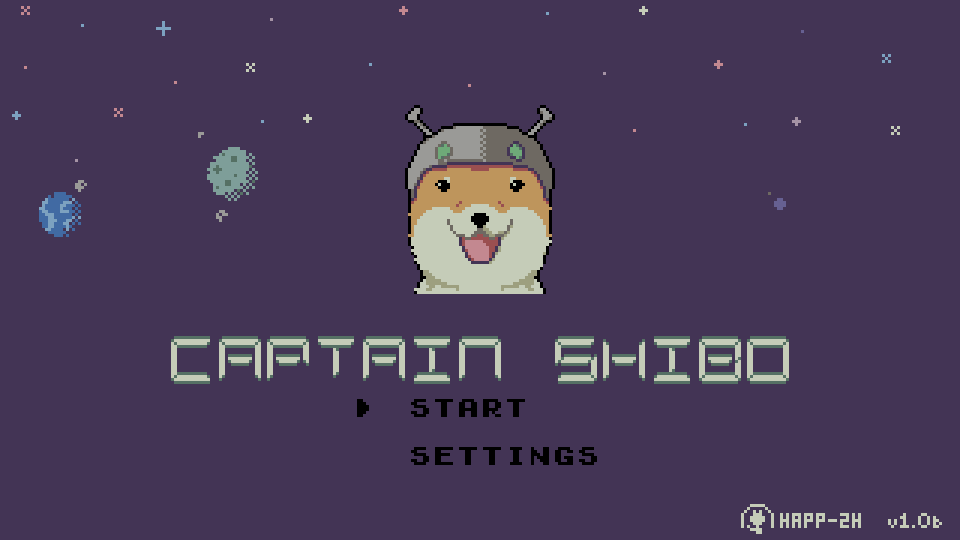
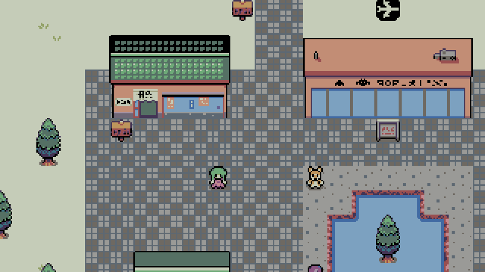
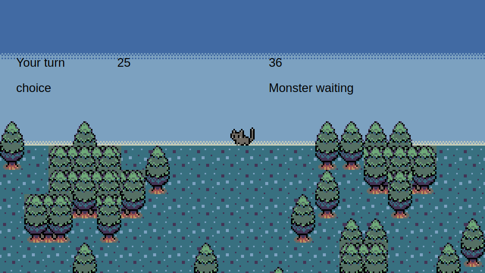
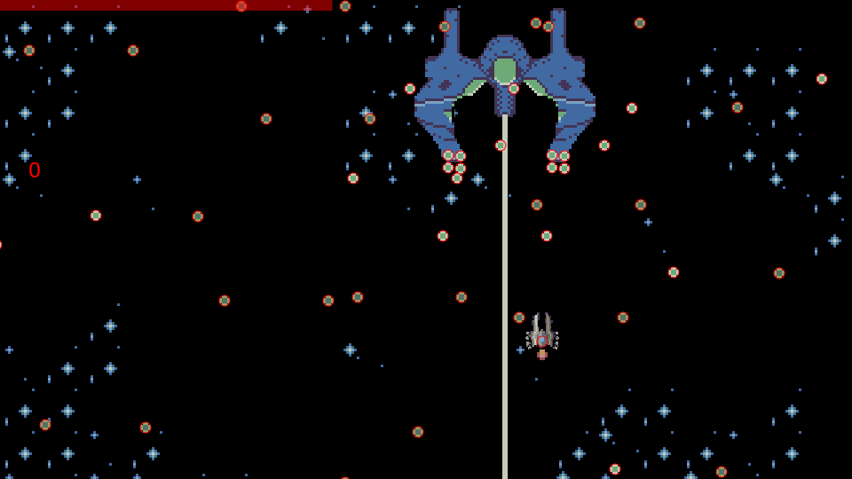

 

  

  <h3>Captain Shibo</h3>

  

    A turn-based RPG mixed SHMUP about a space dog that crash-landed on a planet where dogs are extinct, purposefully. Can he blend in and save this planet actively in war, or does he get caught and tried for betrayal?
  

  
  
  
  

<!-- TODO itch.io link here -->

## Running Locally
1. Make sure you are in the root directory of this project.
    - You should be able to see the index.html file.
1. In a command line, run `yarn` to install the required node modules.
1. Run `yarn dev` to start the development server.
1. You should get a link (default: `http://localhost:5173`) you can connect to to start playing locally.

## Credits
Palette: [Vinik24 by Vinik](https://lospec.com/palette-list/vinik24)

(<a href="#readme-top">Back to top</a>)
